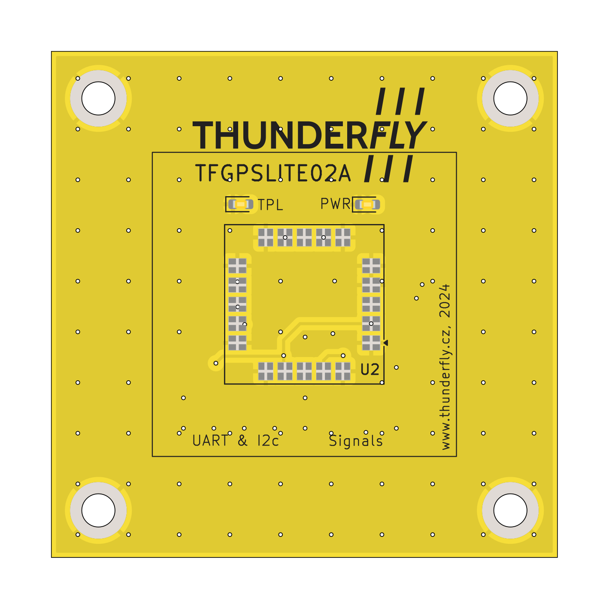
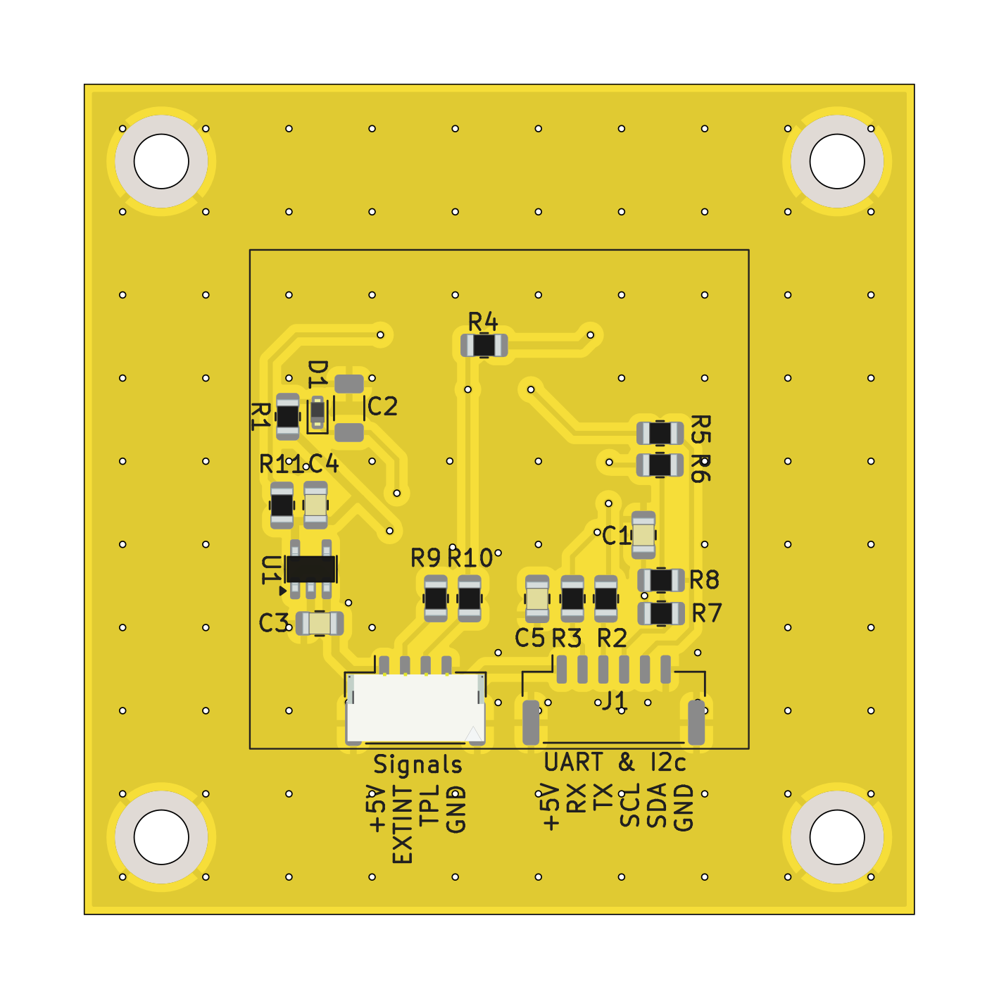

# TFGPSLITE02 - Compact GNSS Module for Lightweight UAVs

The **TFGPSLITE02** module is a compact GNSS solution based on the [u-blox SAM-M8Q](https://www.u-blox.com/en/product/sam-m8q-module). It is designed for small, lightweight, and simple UAVs, offering excellent positioning accuracy with support for multiple satellite constellations. It connects seamlessly to flight controllers via the [Pixhawk standard "Basic GPS Port"](https://github.com/pixhawk/Pixhawk-Standards/blob/master/DS-009%20Pixhawk%20Connector%20Standard.pdf).

## Features

- **GNSS Support**: Concurrent reception of up to three GNSS systems (GPS, Galileo, GLONASS).
- **Compact Design**: Compact form factor (15.5 x 15.5 x 6.3 mm) with integrated patch antenna.
- **High Sensitivity**: Superior performance in environments with weak or obstructed GNSS signals.
- **Augmentation Systems**: Support for SBAS (WAAS, EGNOS, MSAS, GAGAN) and QZSS.
- **Advanced Security**:
  - Geofencing for operational boundaries.
  - Spoofing detection to enhance signal integrity.
  - Message integrity protection.
- **Wide Operational Range**:
  - Altitude: Up to 50,000 m.
  - Velocity: Up to 500 m/s.
  - Dynamic tolerance: Up to 4 g.
- **Built-in RTC**: Ensures faster Time-To-First-Fix (TTFF) after prolonged power-off periods.

## Technical Specifications

- **Interfaces**:
  - UART and I2C (via Basic GPS Port).
  - Time pulse output (1 PPS, configurable up to 10 MHz).
- **Power Supply**:
  - Main supply voltage: 5 V.
  - Typical current consumption is 30 mA.
- **GNSS Performance**:
  - Cold start TTFF: 26 s (GPS).
  - Hot start TTFF: 1 s.
  - Horizontal position accuracy: 2.5 m CEP.
- **Environmental Tolerances**:
  - Operating temperature: -40 °C to 85 °C.
  - Storage temperature: -40 °C to 85 °C.

## Connection to Flight Controller

The module interfaces with flight controllers using the Pixhawk standard **Basic GPS Port**. The port pinout is as follows:

| Pin | Signal    | Voltage |
|-----|-----------|---------|
| 1   | VCC       | +5V     |
| 2   | TX (OUT)  | +3.3V   |
| 3   | RX (IN)   | +3.3V   |
| 4   | I2C SCL   | +3.3V   |
| 5   | I2C SDA   | +3.3V   |
| 6   | GND       | GND     |

## Connection to payload

The module interfaces with the payload with the following signals:

| Pin | Signal    | Voltage |
|-----|-----------|---------|
| 1   | VCC       | +5V     |
| 2   | EXTINT (IN)  | +3.3V   |
| 3   | TPL (OUT)   | +3.3V   |
| 4   | GND       | GND     |

## Where to get it?

The TFGPSLITE02 is commercially available from [ThunderFly s.r.o.](https://www.thunderfly.cz/). For a commercial quotation, contact us by email at sale@thunderfly.cz or shop at our [Tindie store](https://www.tindie.com/stores/thunderfly/).

